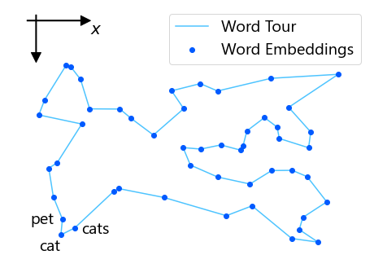
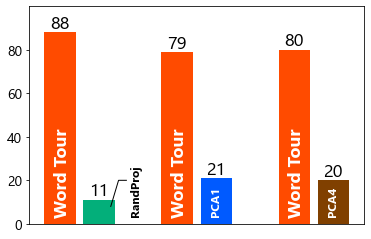

# Word Tour: One-dimensional Word Embeddings via the Traveling Salesman Problem (NAACL 2022)

We proposed one-dimensional word embeddings.

Paper: https://arxiv.org/abs/2205.01954



## 💡 How to Use

`wordtour.txt` is the trained embeddings. The i-th line shows the i-th word in the tour. Note that the embeddings are circular, and thus the first line and the last line are next to each other.

### UPDATE: Optimal Solution (May 14, 2025)

[William Cook](https://www.math.uwaterloo.ca/~bico/) and [Keld Helsgaun](http://webhotel4.ruc.dk/~keld/) _optimally_ solved the Word Tour problem with 40000 words. The optimal tour is available in `wordtour_opt.txt`.

The computation went as follows.

1. Keld created the TSP instance using this GitHub code and data. He
   then found a tour of 236876.914.

2. Bill used Keld’s tour as a starting point for concorde. Computing an LP
   lower bound of value 236873.279. It was not able to continue with a
   branch-and-bound search, since the LP was not able to eliminate many
   of the edges in the graph (using the LKH tour as an upper bound).

3. Bill sent Keld the LP solution, which had 40352 non-zero components,
   with 39652 edges set to the value 1.0. Keld used the 1.0 edges in a
   FIXED_EDGES_SECTION and quickly found with LKH a tour of length 236873523.

4. Keld’s new tour was very close in value to the LP lower bound. This allowed
   concorde to reduce the edge set to 140185 edges. The branch-and-bound run
   then solved the problem in 7180 seconds.

## 📝 Results

### Examples of segments

Each row represents a segment. (a--d) Segments around "cat." (e--h) Segments around "concept." (i--o) Random segments of WordTour. WordTour provides smooth orderings.

|     | Methods  | 1            | 2           | 3           | 4             | 5            | 6             | 7          | 8           | 9           | 10           | 11            |
| --- | -------- | ------------ | ----------- | ----------- | ------------- | ------------ | ------------- | ---------- | ----------- | ----------- | ------------ | ------------- |
| (a) | WordTour | sniff        | sniffing    | sniffer     | dogs          | dog          | cat           | cats       | pets        | pet         | stray        | errant        |
| (b) | RandProj | loire        | sayings     | nn          | trooper       | referendum   | cat           | exceeded   | traces      | freestyle   | mirrored     | bloomberg     |
| (c) | PCA1     | mm           | asylum      | kohl        | presents      | expressed    | cat           | sichuan    | denmark     | counted     | corporations | hewitt        |
| (d) | PCA4     | 1.46         | puzzles     | 940         | coexist       | locations    | cat           | att        | winners     | perth       | colgate      | sohail        |
|     |          |              |             |             |               |              |               |            |             |             |              |               |
| (e) | WordTour | assumption   | assumptions | notions     | notion        | idea         | concept       | concepts   | ideas       | thoughts    | feelings     | emotions      |
| (f) | RandProj | entertaining | 42,000      | kursk       | embarrassment | ingrained    | concept       | berezovsky | cg          | guillen     | excerpts     | roofs         |
| (g) | PCA1     | neighboring  | branches    | argued      | manhattan     | 1998         | concept       | share      | pending     | response    | airlines     | fort          |
| (h) | PCA4     | 2:00         | hksar       | hashim      | provider      | straining    | concept       | inducing   | fightback   | unsettled   | bavaria      | sign          |
|     |          |              |             |             |               |              |               |            |             |             |              |               |
| (i) | WordTour | wireless     | broadband   | 3g          | cdma          | gsm          | handset       | handsets   | smartphones | smartphone  | blackberry   | tablet        |
| (j) | WordTour | gun          | weapon      | weapons     | arms          | arm          | leg           | legs       | limbs       | limb        | prosthetic   | make-up       |
| (k) | WordTour | federalist   | libertarian | progressive | liberal       | conservative | conservatives | liberals   | democrats   | republicans | gop          | republican    |
| (l) | WordTour | cordial      | amicable    | agreeable   | mutually      | beneficial   | detrimental   | harmful    | destructive | disruptive  | behaviour    | behavior      |
| (m) | WordTour | 15th         | 14th        | 13th        | 12th          | 10th         | 11th          | 9th        | 8th         | 7th         | 6th          | 5th           |
| (n) | WordTour | suspicions   | doubts      | doubt       | doubted       | doubting     | doubters      | skeptics   | skeptic     | believer    | believers    | adherents     |
| (o) | WordTour | molten       | magma       | lava        | basalt        | sandstone    | limestone     | granite    | marble      | slab        | slabs        | prefabricated |

### Crawdsourcing Evaluation

Each bar represents the number of times each method was selected by crowdworkers within 100 trials.



### Document Classification

Each cell reports a kNN classification error. Lower is better. The time row reports the average time to compare the two documents. WordTour performs the best in the blurred BoW family.

|          | ohsumed       | reuter        | 20news        | amazon         | classic       |
| -------- | ------------- | ------------- | ------------- | -------------- | ------------- |
| BoW      | 48.1          | 5.6           | 35.4          | 11.4 ± 0.4     | 5.1 ± 0.3     |
| Time     | 39 ns         | 23 ns         | 35 ns         | 21 ns          | 23 ns         |
|          |               |               |               |                |               |
| WordTour | **47.2**      | **4.6**       | **34.1**      | **10.1 ± 0.3** | **4.6 ± 0.1** |
| RandProj | 47.9          | 5.4           | 35.4          | 11.3 ± 0.3     | 5.1 ± 0.3     |
| PCA1     | 47.8          | 5.7           | 35.5          | 11.4 ± 0.6     | 5.1 ± 0.3     |
| PCA4     | 48.1          | 5.6           | 35.4          | 11.6 ± 0.5     | 5.1 ± 0.4     |
| Time     | 206 ns        | 142 ns        | 312 ns        | 185 ns         | 150 ns        |
|          |               |               |               |                |               |
| WMD      | 47.5          | 4.5           | 30.7          | 7.6 ± 0.3      | 4.2 ± 0.3     |
| Time     | 3.5 x 10^6 ns | 2.2 x 10^6 ns | 5.1 x 10^6 ns | 1.2 x 10^7 ns  | 1.9 x 10^6 ns |

## ⛏️ How to Build WordTour by Yourself

1. Install the dependencies.

```
$ sudo apt install wget unzip build-essential
```

2. Download the GloVe embeddings and LKH solver.

```
$ ./download.sh
```

3. Compile the generator.

```
$ make
```

4. Create the LKH config file.

```
$ ./make_LKH_file
Usage: ./make_LKH_file [embedding file path] [#words]
$ ./make_LKH_file ./glove.6B/glove.6B.300d.txt 400 > ./LKH-3.0.6/wordtour.tsp
$ cp wordtour.par ./LKH-3.0.6/wordtour.par
```

Here, 400 is used for an illustration purpose. 40000 words may take a few minutes and consume a few GB of strage.

5. Compile the LKH solver.

```
$ cd LKH-3.0.6
$ make
```

6. Run the LKH solver.

```
$ ./LKH wordtour.par
```

Note: The result is saved in `wordtour.out`.

Note: It may take several hourds to run the LKH solver with 40000 words.

7. Extract the word list.

```
$ cd ..
$ python generate_order_file.py
$ cat wordtour.txt
```

## 🧪 How to Evaluate

1. Download the Datasets.

You also need to run `./download.sh` if you haven't yet.

```
$ ./download_datasets.sh
```

2. Preprocess.

```
$ python ./preprocess.py
```

3. Evaluate.

Be sure that the embeddings files, `wordtour.txt`, `order_randproj.txt`, `order_pca1.txt`, and `order_pca4.txt`, contain the embeddings you want to evaluate. It might contain only 400 words if you ran the "How to Build WordTour by Yourself" scripts.

```
$ python evaluate.py
```

## 🖋️ Citation

```
@inproceedings{sato2022wordtour,
  author    = {Ryoma Sato},
  title     = {Word Tour: One-dimensional Word Embeddings via the Traveling Salesman Problem},
  booktitle = {Proceedings of the 2022 Conference of the North American Chapter of the Association for Computational Linguistics: Human Language Technologies, {NAACL-HLT}},
  year      = {2022},
}
```
